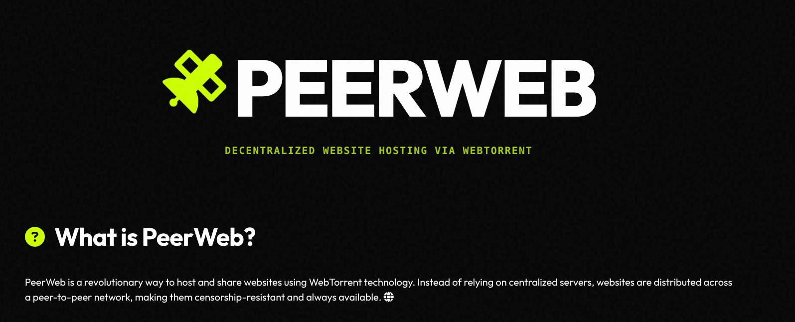

# PeerWeb

**Decentralized, Autonomous, & Unstoppable Website Hosting**

 

---

## This project has moved!

The full source code, documentation, and executables are now hosted on **Codeberg** (a non-profit, ethical alternative to GitHub).

### [View the project on Codeberg](https://codeberg.org/anarchymedialibertaire/pages)

### [Live Demo](https://anarchymedialibertaire.codeberg.page/)

---

*PeerWeb enables decentralized website hosting via WebTorrent. No servers, no fees, no censorship.*
